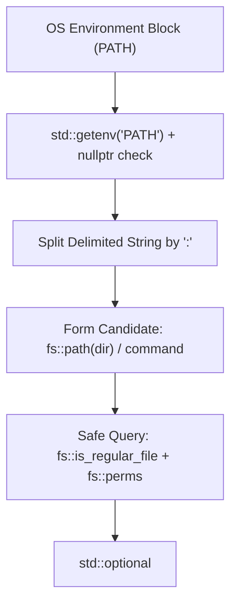

# Resolving Executables via PATH in Modern C++

> **Mastery Status**: 🌿 Solid  
> **Date**: 2026-09-25  
> **Prerequisites**: C++20/23, Process Environment, POSIX Filesystem Permissions  

---

## 1. Unconditional Truths (The Bedrock)

- **Process Environment**: `std::getenv(name)` inspects the process environment block and returns `const char*` pointing to the value, or `nullptr` if the variable does not exist. Constructing a `std::string` or accessing a null pointer is undefined behavior.
- **POSIX Executability**: On Unix/Linux systems, whether a file is an executable program is determined exclusively by permission bits (`X_OK`) on the file's inode, not by file extensions (like `.exe`).
- **Direct Path Lookup ($O(1)$)**: Finding an executable named `target` across directories does not require scanning folder contents ($O(N)$); candidate paths are formed directly (`dir / target`) and queried directly against the filesystem.
- **Path Composition**: `std::filesystem::path::operator/` handles missing or duplicate slashes and platform-specific separators automatically.

---

## 2. The Dependency Map



---

## 3. Motivated Discovery (The "Why")

- **Why Not Cache the Parsed PATH?**: In shells, environment variables can change dynamically at runtime (`export PATH=...`). Splitting a 100-character string takes ~50 nanoseconds (in L1 cache), whereas disk I/O takes microseconds to milliseconds. Caching `PATH` saves virtually zero time while introducing subtle cache-invalidation bugs.
- **Why Path Delimiter is Not in Standard C++**: `<filesystem>` standardizes paths on disk (`/` vs `\`), but environment variable conventions are OS-specific runtime concepts. In C++, path list delimiters (`:` on POSIX, `;` on Windows) are handled with compile-time checks (`#if defined(_WIN32)`).
- **Separation of Concerns**: Syntax parsing (`Tokenizer` & `Parser`) operates on strings and grammar without OS knowledge. `Executor` interacts with OS environment variables and disk storage.

---

## 4. Misconceptions Dislodged

| Misconception | Why It Was Tempting | Correction | Discriminator |
| :--- | :--- | :--- | :--- |
| **"We must open folders and iterate through files to find a match"** | Intuitive mental model of looking inside a drawer. | You already know the target filename; directly query `dir / target` in $O(1)$ time. | Direct `fs::is_regular_file(dir / target)` vs iterating `directory_iterator`. |
| **"Caching parsed PATH is necessary for performance"** | String parsing sounds computationally expensive. | Parsing is nanoseconds; disk access is orders of magnitude slower. Caching causes stale environment bugs. | Dynamic query cost ($\approx 50$ ns) vs Cache Invalidation risk. |
| **"Short variable names like `dir`, `ec`, `fs` are unprofessional"** | Desire to be verbose and explicit. | Industrial C++ follows the Scope-to-Length Proportionality Rule: local 3-line scopes prefer concise canonical names (`ec`, `dir`). | Scope size: $<5$ lines $\rightarrow$ short; public API $\rightarrow$ descriptive. |

---

## 5. What Clicked (Effective Analogies & Examples)

- **The Scope-to-Length Rule**: Variable length should be proportional to scope size. `ec` for `std::error_code` and `dir` inside a 5-line loop enhance signal-to-noise ratio; verbose names in tiny scopes create cognitive clutter.
- **Direct Address vs Drawer Search**: Querying `fs::path(dir) / target` is like mailing a letter to a specific house address rather than searching house-to-house through the whole neighborhood.

---

## 6. Production Implementation Pattern

```cpp
#include <cstdlib>
#include <filesystem>
#include <optional>
#include <string_view>
#include <system_error>

namespace fs = std::filesystem;

bool IsExecutableFile(const fs::path &path, std::error_code &ec) {
  if (!fs::is_regular_file(path, ec)) {
    return false;
  }
  auto perms = fs::status(path, ec).permissions();
  return (perms & (fs::perms::owner_exec | fs::perms::group_exec |
                   fs::perms::others_exec)) != fs::perms::none;
}

std::optional<fs::path> FindExecutable(std::string_view command_name) {
  const char *path_env = std::getenv("PATH");
  if (path_env == nullptr) {
    return std::nullopt;
  }

  std::error_code ec;
  for (const auto &dir : Split(path_env, ":")) {
    fs::path full_path = fs::path(dir) / command_name;
    if (IsExecutableFile(full_path, ec)) {
      return full_path;
    }
  }

  return std::nullopt;
}
```

---

## 7. Active Recall Flashcards (Self-Quiz)

<details>
<summary><b>Q1: What happens if you pass an unset variable name to <code>std::getenv</code>, and how must you handle it?</b></summary>

**Answer**: It returns `nullptr`. You must explicitly check `path_env == nullptr` before using it or passing it to `std::string` to avoid a segmentation fault.
</details>

<details>
<summary><b>Q2: Why should <code>std::filesystem</code> query functions be passed a <code>std::error_code</code> argument in search loops?</b></summary>

**Answer**: When `std::error_code ec` is supplied, functions like `fs::is_regular_file(path, ec)` will not throw a `std::filesystem_error` exception if a directory does not exist or lacks read permissions; they set `ec` and safely return `false`.
</details>

<details>
<summary><b>Q3: What distinguishes a directory separator from a PATH list delimiter in C++?</b></summary>

**Answer**: A directory separator divides folders in a single path (`/` or `\`, handled by `fs::path::preferred_separator` and `operator/`). A PATH list delimiter divides separate directories in an environment variable (`:` on POSIX, `;` on Windows, requiring manual `#if defined(_WIN32)`).
</details>
