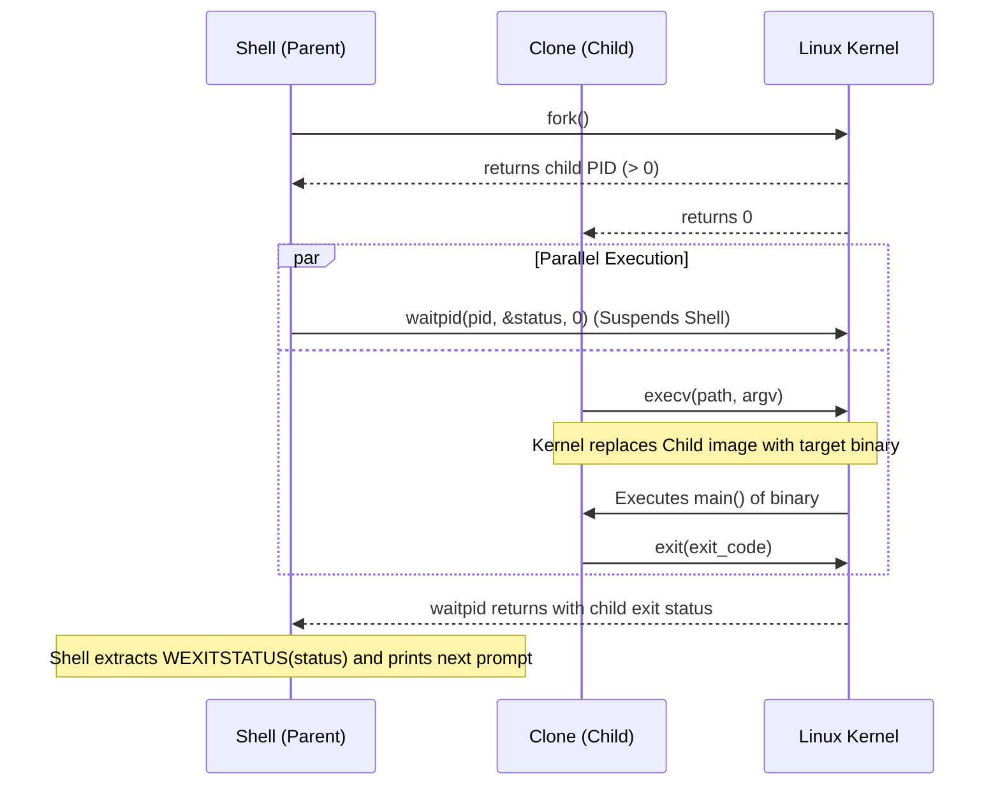

# Unix Process Execution: fork, execv, and waitpid

> **Mastery Status**: 🌿 Solid  
> **Date**: 2026-09-25  
> **Prerequisites**: [Resolving Executables via PATH](path-searching-executables.md), POSIX Process Model  

---

## 1. Unconditional Truths (The Bedrock)

- **`exec` Destructive Replacement**: When an `exec` family function succeeds, it completely and irreversibly overwrites the calling process's memory space (code, stack, heap) with the new binary image. It never returns.
- **Process Spawning Decomposition**: In Unix, creating a process and running a new program are orthogonal: `fork()` creates an identical child process; `execv()` transforms a process into a target binary.
- **Argv Invariant**: `execv(pathname, argv)` requires `argv` to be a null-terminated array of pointers (`argv[n] == nullptr`), where `argv[0]` is by convention the command name.
- **Child Error Trapping**: `execv` returns only if the kernel fails to load the binary (`-1`). A child process that reaches past `execv` must immediately terminate via `std::exit(1)` to avoid running as a duplicate "ghost" shell.

---

## 2. The Process Lifecycle Map



---

## 3. Motivated Discovery (The "Why")

- **Why Not Spawn Directly (like Windows `CreateProcess`)?**: Unix separated `fork()` and `exec()` to allow the parent/child to configure file descriptors (redirection: `>`, `<`, `|`), environment variables, and process groups in the child *before* executing the target binary, without needing dozens of parameters in `CreateProcess`.
- **Why `perror` and `std::exit(1)` After `execv`?**: If an executable fails to load (e.g. invalid ELF header, missing shebang interpreter), `execv` returns `-1`. Without `std::exit(1)`, the child would return to the shell REPL loop, resulting in two duplicate shell processes competing for terminal `stdin`.

---

## 4. Production Implementation Pattern

```cpp
#include <sys/wait.h>
#include <unistd.h>
#include <vector>

ExecutionResult ExecuteExternal(const fs::path &path,
                                const SimpleCommand &command) {
  // 1. Build null-terminated argv: [name, arg1, ..., nullptr]
  std::vector<char *> args;
  args.reserve(command.arguments.size() + 2);
  args.push_back(const_cast<char *>(command.name.c_str()));
  for (const auto &arg : command.arguments) {
    args.push_back(const_cast<char *>(arg.c_str()));
  }
  args.push_back(nullptr);

  // 2. Clone the process
  pid_t pid = fork();
  if (pid < 0) {
    perror("fork");
    return ExecutionResult{.should_exit = false, .exit_code = 1};
  }

  // 3. Child Branch: replace memory image
  if (pid == 0) {
    execv(path.c_str(), args.data());
    // Only reached if execv fails!
    perror("execv");
    std::exit(1);
  }

  // 4. Parent Branch: wait for child completion
  int status = 0;
  waitpid(pid, &status, 0);

  int exit_code = 0;
  if (WIFEXITED(status)) {
    exit_code = WEXITSTATUS(status);
  }

  return ExecutionResult{.should_exit = false, .exit_code = exit_code};
}
```

---

## 5. Active Recall Flashcards (Self-Quiz)

<details>
<summary><b>Q1: Under what conditions does <code>execv</code> return to the caller?</b></summary>

**Answer**: Only on failure (returns `-1`). If it succeeds, the entire calling process memory image is overwritten by the new program, so it never returns.
</details>

<details>
<summary><b>Q2: What disastrous bug happens if a child process omits <code>std::exit(1)</code> after a failed <code>execv</code>?</b></summary>

**Answer**: The child process remains an exact clone of the shell, returns from `Execute()`, and enters the shell's input loop. This results in two shell processes running concurrently in the terminal, competing for keyboard input.
</details>

<details>
<summary><b>Q3: What are the two mandatory conventions for the <code>argv</code> array passed to <code>execv</code>?</b></summary>

**Answer**: 
1. `argv[0]` must point to the command name.
2. The final element `argv[n]` must be a null pointer (`nullptr`).
</details>
